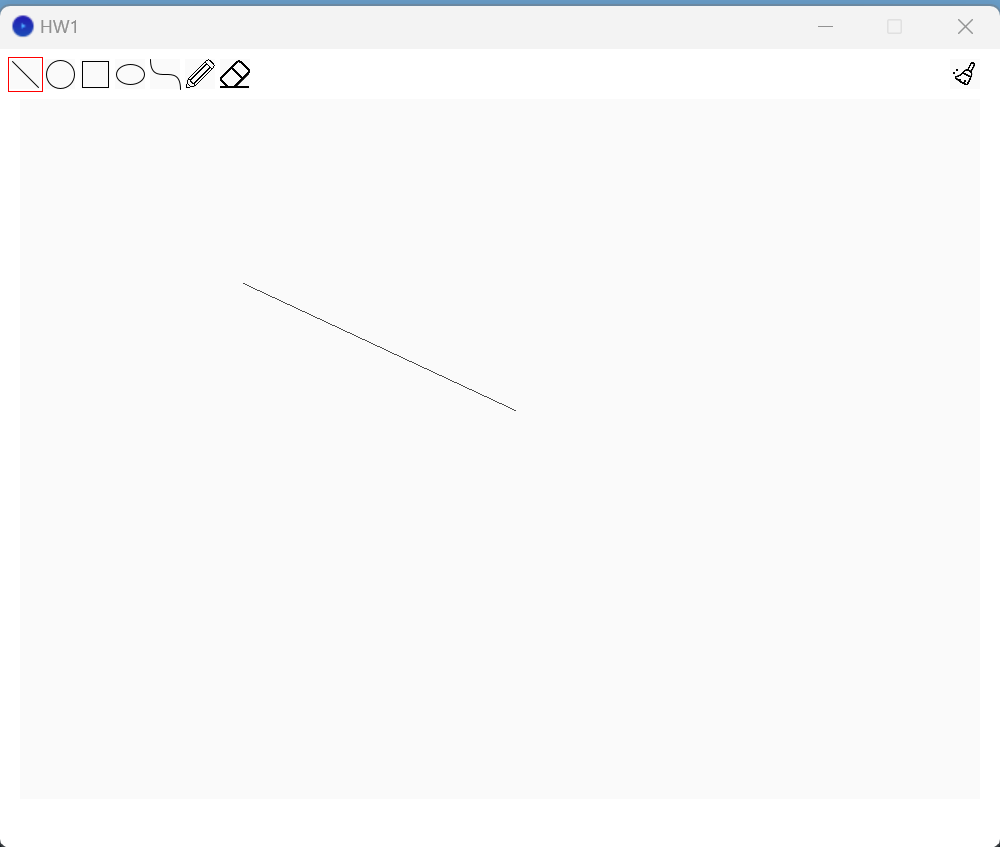

# Homework1

### Which tasks you have completed
- [x] complete the line algorithm.
- [x] complete the circle algorithm.
- [x] complete the ellipse algorithm.
- [x] complete the curve algorithm.
- [x] complete the eraser.

### Some screenshots of your work
- Line

- Circle

- Rectangle

- Ellipse

- Curve

- Pencil

- Eraser

### How you completed these tasks
Among the five requirements, I encountered more significant challenges when implementing the ellipse and curve sections. I consulted ChatGPT with the unfinished code for these two parts, and then I completed the code based on the suggestions provided by ChatGPT.
